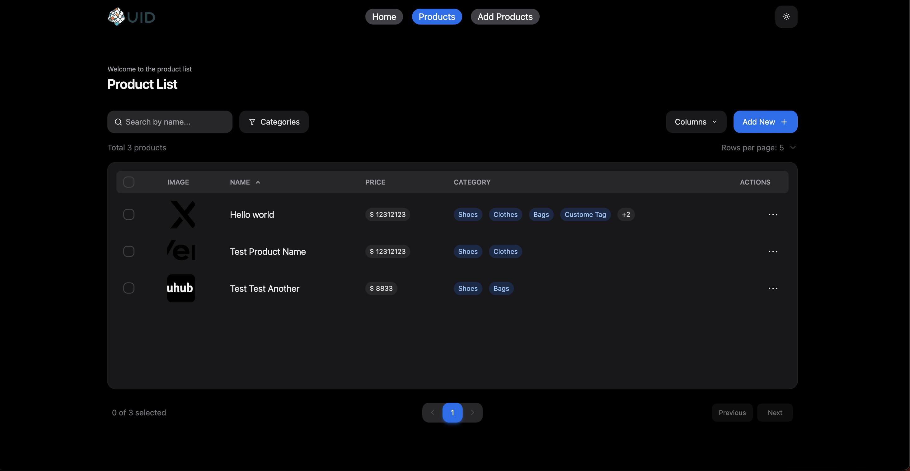

## Junior Fe Test

> Vite RTK Query temptelte.  
> This include React+TS with familiar pre-setup tooling  
> Redux Toolkit, RTK Query, React Router, eslint-config-ts-prefixer, Vitest/TS/**react**-testing-library/MSW, tailwindcss, CSS Modules GitHub Actions CI.

## [Try Online](https://happy-uid-test.vercel.app/)



## Stack

- [Redux Toolkit](https://redux-toolkit.js.org/)
- [RTK Query](https://redux-toolkit.js.org/rtk-query/overview)
- [eslint-config-ts-prefixer](https://github.com/laststance/eslint-config-ts-prefixer). Specialized fixable(`--fix` option) rule sets. Zero extend any recommended for confortable DX.
- [Vitest](https://vitest.dev/), [React Testing Library](https://testing-library.com/docs/react-testing-library/intro/), [MSW](https://mswjs.io/)
- [tailwindcss](https://tailwindcss.com/)
- [Github Actions](https://github.com/features/actions)

All npm package are keeping least release version powered by [Dependabot](https://github.com/dependabot).

## Quick start

**Clone Repo**

```
git clone git@github.com:tonible14012002/HappyUID-Test.git
cd HappyUID-Test
```

## Development

```
pnpm install
pnpm validate
pnpm dev
```

## Commands

```bash
pnpm dev             # start development server
pnpm start           # start development server
pnpm validate        # run test,lint,build,typecheck concurrently
pnpm test            # run vitest
pnpm test:watch      # run vitest watch mode
pnpm lint            # run eslint
pnpm lint:fix         # run eslint with --fix option
pnpm typecheck       # run TypeScript compiler check
pnpm build           # build production bundle to 'dist' directly
pnpm prettier        # run prettier for json|yml|css|md|mdx files
pnpm clean           # remove 'node_modules' 'yarn.lock' 'dist' completely
pnpm serve           # launch server for production bundle in local
pnpm remove:tailwind # remove TailwindCSS
```
